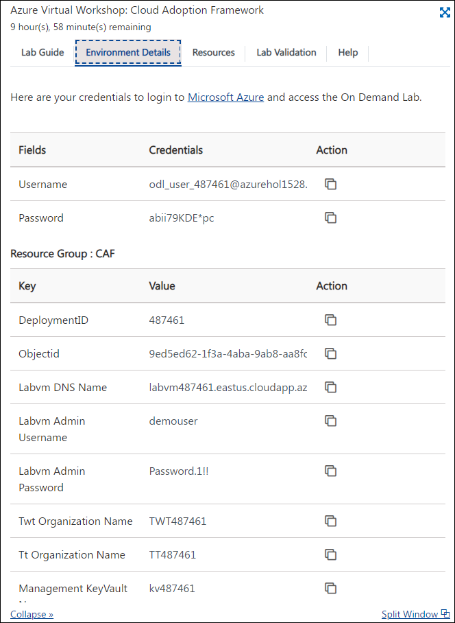
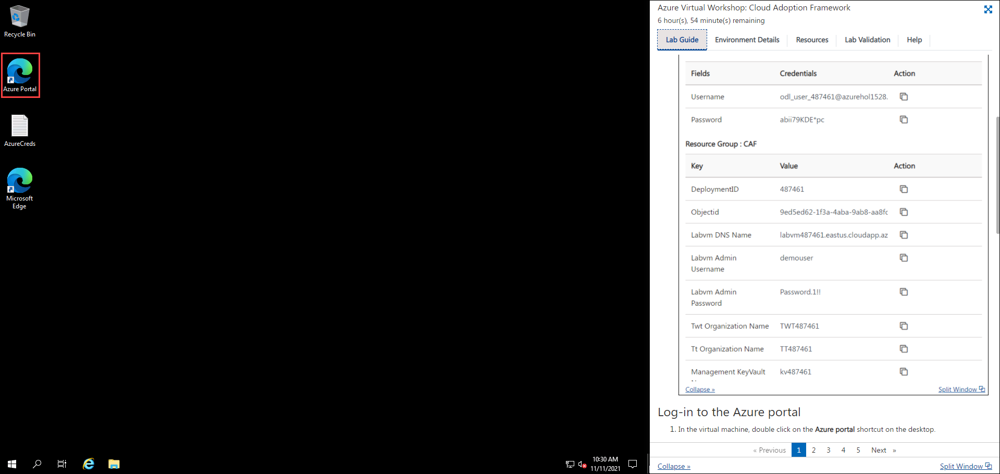

## **Getting Started**

## Instructions

1. Once the environment is provisioned, a virtual machine (JumpVM) on the left and a lab guide on the right will get loaded in your browser. Use this virtual machine throughout the workshop to perform the lab.

2. To get the lab environment details, select the **Environment details** tab located in the upper right corner. Additionally, the credentials will also be sent in your email-id provided during the registration.

   
   
## Log-in to the Azure portal

1. In the virtual machine, open **Azure Portal** from the desktop app.
   
   

2. On the **Sign in to Microsoft Azure** blade, you will see a login screen. Enter the following email/username in the respective fields. 
   * Email/Username: <inject key="AzureAdUserEmail"></inject>

3. Now enter the following password and click on **Sign in**.
   * Password: <inject key="AzureAdUserPassword"></inject>
   
4. If you see the pop-up **Help us protect your account**, click **Skip for now (14 days until this is required)**.
   
   
   
5. If you see the pop-up **Stay Signed in?**, click on **Yes**.

6. If you see the pop-up **You have free Azure Advisor recommendations!** Close the window and continue.

7. If the **Welcome to Microsoft Azure** popup window appears, click **Maybe Later** to skip the tour.

8. Click on the **Next** button present in the bottom-right corner of this lab guide.

