# Exercise 1: Start

## Context

The Enterprise-Scale architecture is modular by design and allows organizations to start with foundational landing zones that support their application portfolios, regardless of whether the applications are being migrated or are newly developed and deployed to Azure. The architecture enables organizations to start as small as needed and scale alongside their business requirements regardless of scale point.
The Wing Tip company wants to start with Landing Zones for their workload in Azure, where hybrid connectivity to their on-premise data center is not required from the start. 

### Reference architecture

This reference implementation is ideal for customers who want to start with Landing Zones for their workload in Azure, where hybrid connectivity to their on-premise data center is not required from the start. You can build a flexible structure of management groups and subscriptions to organize your resources into a hierarchy for unified policy and access management. The following diagram shows an example of creating a hierarchy for governance using management groups.

 

If your organization has many subscriptions, you may need a way to efficiently manage access, policies, and compliance for those subscriptions. Azure management groups provide a level of scope above subscriptions. You organize subscriptions into containers called **management groups** and apply your governance conditions to the management groups. All subscriptions within a management group automatically inherit the conditions applied to the management group. Management groups give you enterprise-grade management at a large scale no matter what type of subscriptions you might have. All subscriptions within a single management group must trust the same Azure Active Directory tenant.

## In this Section

- [Pre-requisites](#pre-requisites)
- [Reference implementation deployment](#reference-implementation-deployment)
- [Validation post deployment (GitHub)](#validation-post-deployment-github)
- [Post deployment activities](#post-deployment-activities)
- [Operating the Azure platform using AzOps (Infrastructure as Code with GitHub Actions)](#operating-the-azure-platform-using-azops-infrastructure-as-code-with-github-actions)

---
Enterprise-Scale can be deployed both from the Azure portal directly, or from [GitHub](https://github.com/Azure/Enterprise-Scale#deploying-enterprise-scale-architecture-in-your-own-environment)

## Reference Implementation Deployment

In the *Deploying Enterprise-Scale Architecture in your own environment* [article](https://github.com/Azure/Enterprise-Scale#deploying-enterprise-scale-architecture-in-your-own-environment), when you click on *Deploy to Azure* for the selected Enterprise-Scale reference implementation, it will load the deployment experience in the Azure portal into your default Azure tenant. In case you have access to multiple tenants, ensure you are selecting the right one.

Please note that the steps below are for the AdventureWorks reference implementation, but a similar experience would be for the WingTip or Contoso reference implementations, with a slightly different experience for the network resources configuration.

### Deployment location

On the first page, select the *Region*. This region will primarily be used to place the deployment resources in an Azure region, but also used as the initial region for some of the resources that are deployed, such as Azure Log Analytics and Azure automation.

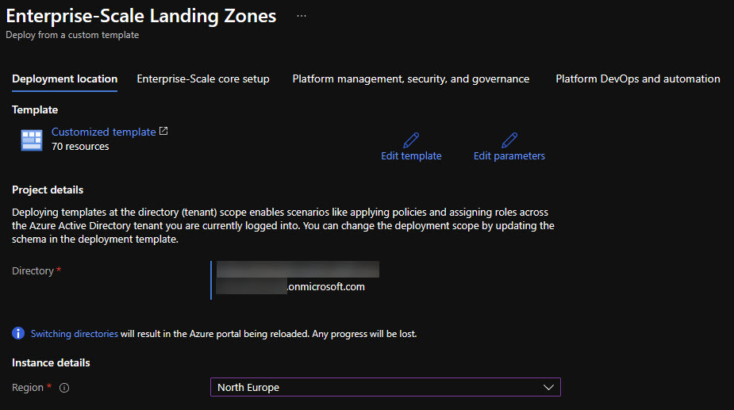

### Enterprise-Scale core setup

Provide a prefix that will be used to create the management group hierarchy and platform resources, and select if you would use dedicated subscriptions or a single subscription for platform resources (please note that dedicates subscriptions are recommended). For this scenario, select Dedicated.

### Platform management, security, and governance

On the *Platform management, security, and governance* blade, you will configure the core components to enable platform monitoring and security. The options you enable will also be enforced using Azure Policy to ensure resources, landing zones, and more are continuously compliant as your deployments scales and grows. To enable this, you must provide a dedicated (empty) subscription that will be used to host the requisite infrastructure.

Please note that if you enable the "Deploy Azure Security Center and enable security monitoring for your platform and resources" option, you will need to provide an email address to get email notifications from Azure Security Center.

### Platform DevOps and Automation

You can choose to bootstrap your CI/CD pipeline (GitHub with GitHub actions). Provide your GitHub user/org name, the preferred name of the GitHub repository that is to be created, as well as the PA token that the deployment will use to create a new repository and discover the Enterprise-Scale deployment ARM templates and merge them into your main branch.

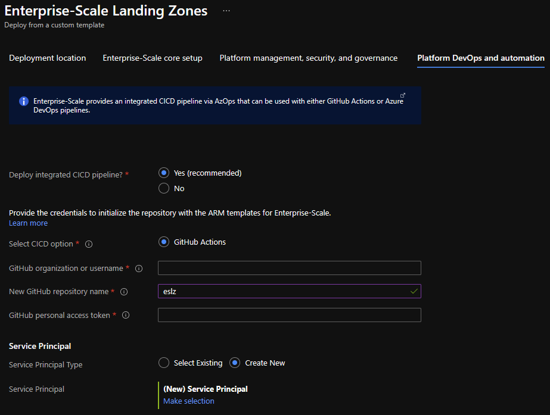

1.1.1    To create a PA token, follow the instructions here: https://docs.github.com/en/github/authenticating-to-github/creating-a-personal-access-token

1.1.2    Ensure the PA token has the following permissions:

> For Microsoft employees who are enrolled into the Azure GitHub organization, you must also authorize the PA token to this Org!

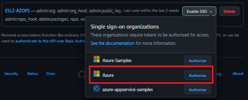

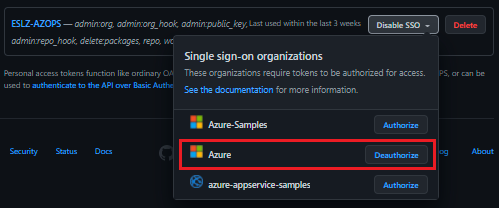

1.2  Lastly, a Service Principal is required for Git to authenticate to – and be authorized to your Azure tenant. You can either use an existing Service Principal or create a new one. The Service Principal will be granted *Owner* permission on the top level Management Group that gets created.

1.2.1    If using an existing Service Principal, ensure you have the *client secret* as this must be provided as the *Password* for the service principal and confirm it has the right level of permission.

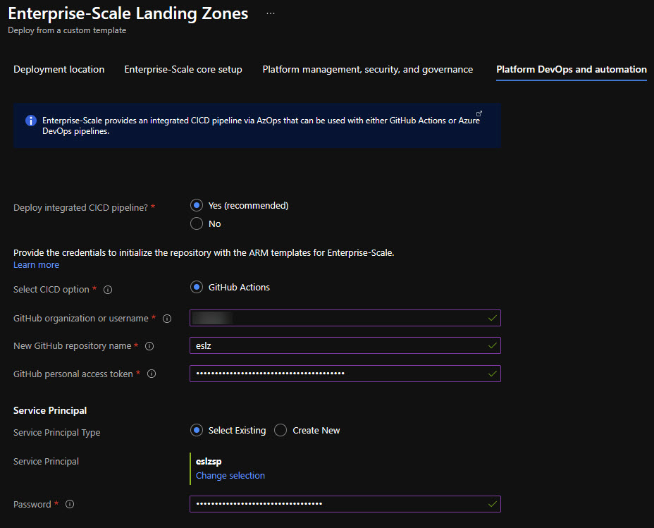

1.2.2    If creating a new Service Principal, select "Create New" and click on Make selection” and the portal will open a new blade for app registration

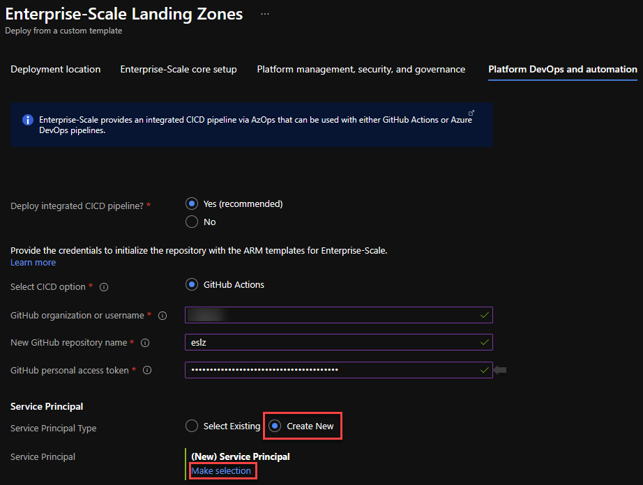

 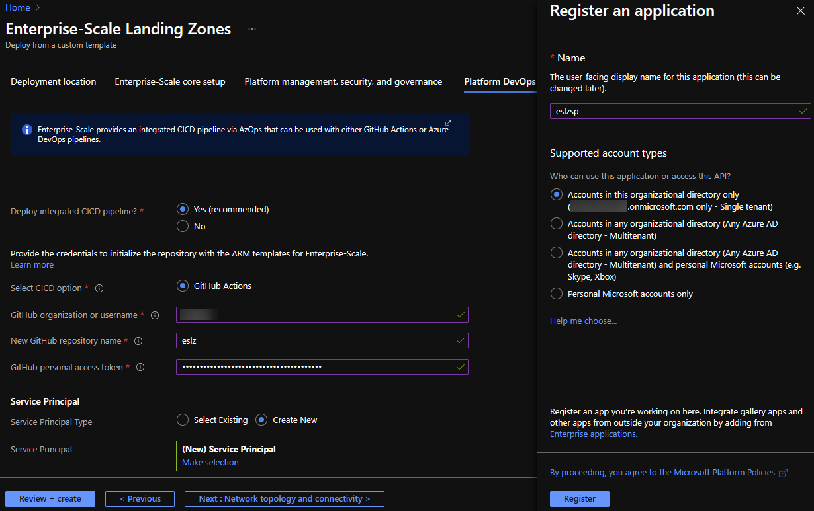

Once the App has been registered, you must explicitly create a new secret.

 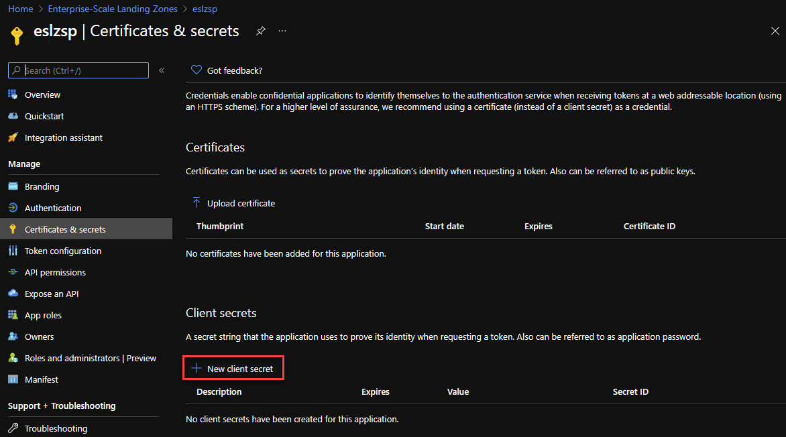

 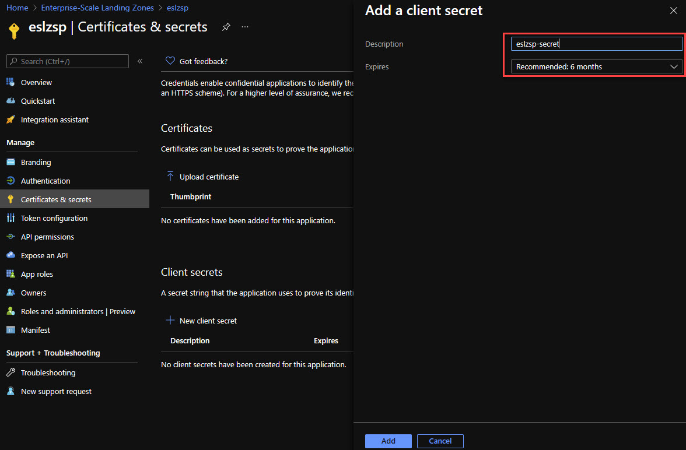

Make sure to note down the “Value” of the new client secret.
 

The default API Permissions for this App are “User.Read”, as depicted below:

 After copying the secret, go to “Enterprise-Scale Landing Zones” (in the upper left) to return to the deployment.

 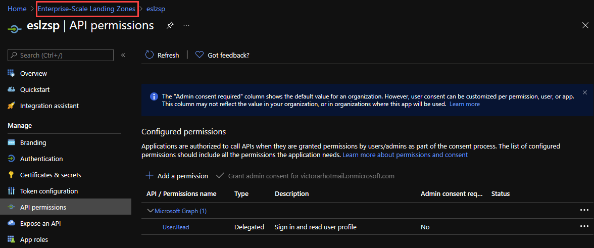

 At this point, paste the client secret value of the newly created client secret from a few step above into the Password field.

 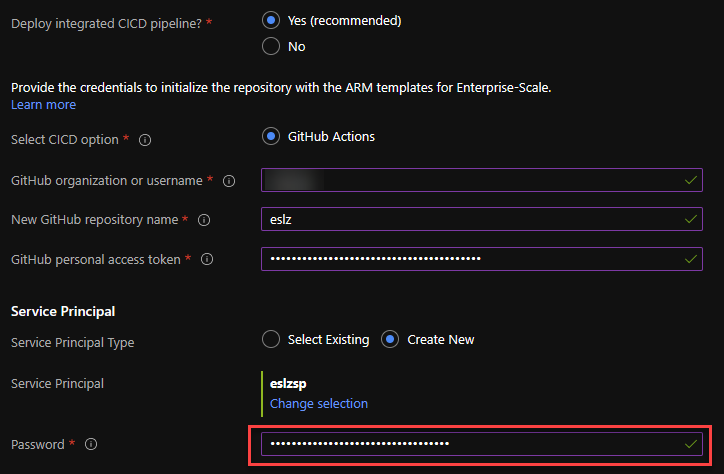

### Network topology and connectivity
On the *Network topology and connectivity* blade, you will configure the core networking platform resources, such as hub virtual network, gateways (VPN and/or ExpressRoute), Azure Firewall, DDoS Protection Standard and Azure Private DNS Zones for Azure PaaS services. To deploy and configure these network resources, you must select a network topology (for this scenario, select either "Hub and spoke with Azure Firewall" or "Hub and spoke with your own third-party NVA"), provide the address space to be assigned to the hub virtual network, select an Azure region where the hub virtual network will be created and provide a dedicated (empty) subscription that will be used to host the requisite infrastructure. For this example, we will select the "Hub and spoke with Azure Firewall" network topology.

 

Depending on your requirements, you may choose to deploy additional network infrastructure for your Enterprise-Scale landing zones platform. The optional resources include:

* DDoS Protection Standard
* Azure Private DNS Zones for Azure PaaS services
* VPN and ExpressRoute Gateways
  * If you choose to deploy either or both of these gateways, you will have the option to select the subnet to be dedicated for these resources, if you decide to deploy them as regional or zone-redundant gateways, as well as choose the right SKU based on your requirements
* Azure Firewall
  * If you choose to deploy Azure Firewall, you will have the option to select the subnet, select to deploy the Firewall as regional or zone redundant as well as indicate if you want to enable DNS Proxy in Azure Firewall

 

### Identity
On the *Identity* blade you can specify if you want to assign recommended policies to govern identity and domain controllers. If you decide to enable this feature, you to need provide an empty subscription for this. You can then select which policies you want to get assigned, and you will need to provide the address space for the virtual network that will be deployed on this subscription. Please note that this virtual network will be connected to the hub virtual network via VNet peering. 

 

### Landing zone configuration

You can optionally bring in N number of subscriptions that will be bootstrapped as landing zones, governed by Azure Policy. You indicate which subscriptions will be bootstrapped as landing zones with a virtual network deployed and connected to the hub virtual network for corp connectivity. Virtual networks on these subscriptions will be connected to the hub virtual network using VNet peering, and if you deployed and enabled Azure Firewall as DNS proxy, DNS settings on these VNets will be configured with the Azure Firewall private IP address.

You can also indicate which subscriptions you would like to be bootstrapped as landing zones but without corp connectivity. Finally, you can select which policy you want to assign broadly to all of your landing zones.

As part of the policies that you can assign to your landing zones, the Enterprise-Scale Landing Zones deployment experience will allow you to protect your landing zones with a DDoS Standard plan, and for corp connected landing zones, you will have the option to prevent usage of public endpoints for Azure PaaS services as well as ensure that private endpoints to Azure PaaS services are integrated with Azure Private DNS Zones. 

### Review + create

*Review + Create* page will validate your permission and configuration before you can click deploy. Once it has been validated successfully, you can click *Create*

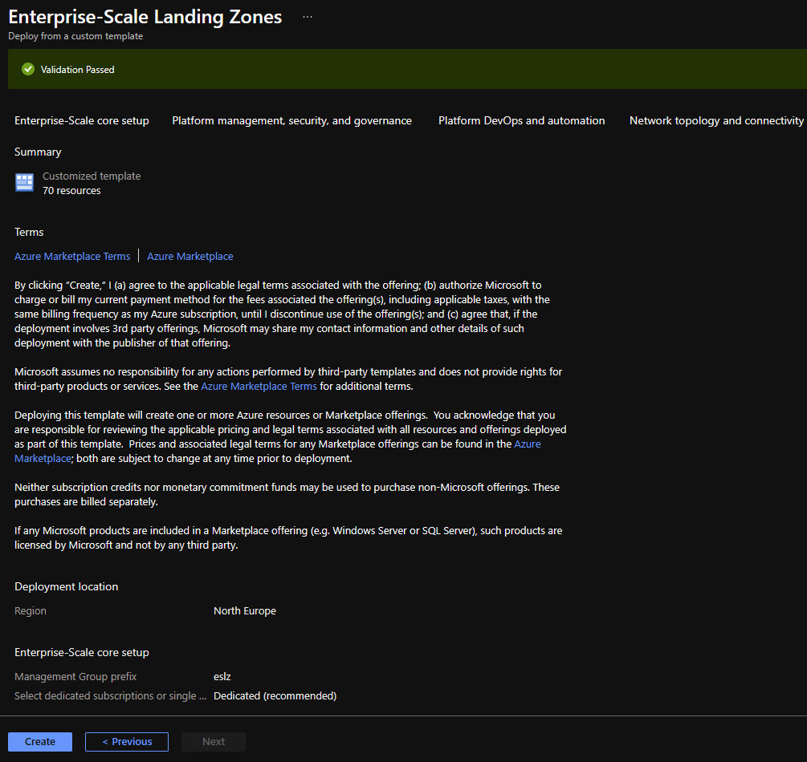

### Validation post deployment (GitHub)

Once Enterprise-Scale has deployed and you enabled the CI/CD bootstrap, you should validate in your GitHub account that:

*    A new repository has been created, with the name provided during setup.

*    4 Secrets are created into this GitHub repository.

ARM_CLIENT_ID = Service Principal

ARM_CLIENT_SECRET = Service Principal Client Secret created in the Tenant
ARM_SUBSCRIPTION_ID = The management subscription ID created in the Tenant
ARM_TENANT_ID = Tenant ID of the Azure Tenant that was used to create ESLZ

*    A Pull Request is either in progress or has completed and automatically merged into the main branch.

*    The Azure hierarchy that got created using ARM templates as part of the Enterprise-Scale setup, such as management groups, subscription organization as well as policy definitions, policy assignments and role assignments are hydrated and organized into Git:

*    In each folder, you will find the ARM templates that were deployed at the scopes during the Enterprise-Scale setup. E.g., on the intermediate root group, you will find all policy definitions, and depending on the selection you made during the deployment, you will find resource templates in the platform subscriptions. Users can – whenever they are ready, start using these templates and bring their own templates to manage the platform using ARM templates and infrastructure as code.

## Post deployment activities

Once Enterprise-Scale has deployed, you can grant your application teams/business units access to their respective landing zones. Whenever there’s a need for a new landing zone, you can place them into their respective management groups (Online or Corp) given the characteristics of assumed workloads and their requirements.
