# Exercise 3: Manage and update your infrastructure

### What is AzOps?

AzOps is an opinionated CI/CD pipeline to operationalize the Azure *platform* and *landing zones* that enables organizations to focus on the ARM template development, and not having to deal with multiple deployment scripts targeting different Azure scopes. The organization and folder structure in Git is dynamically representing the Azure graph (management groups (parent, child relationships), and subscription organization), so the platform operators can easily determine at which *scope* they want to invoke the ARM template deployment by simply making a PR with the ARM template(s) and parameter files (optionally), and AzOps will invoke the deployment accordingly.

Also, when there’s a new *scope* (management groups, subscriptions, and resource groups) being created, either explicitly via the pipeline – and also out of band (via Portal, CLI, PS etc.), AzOps will discover these and represent them correctly back into Git.

>You will be using the subscription **Sub 05 - Suffix** and the resource group **CAF** for this exercise.

This exercise includes the following tasks:

- [Task 1: Enhance your governance posture](#task-1-enhance-your-governance-posture)
- [Task 2: Enhance your security posture](#task-2-enhance-your-security-posture)


### Operating the Azure platform using AzOps (Infrastructure as Code with GitHub Actions)

When you have deployed Enterprise-Scale with GitHub integration, you will have a ready-to-go repository with integrated GitHub Actions containing all the ARM templates that were used during deployment, organized in the following way:

*    Management group tree structure represented as folders in Git

*    Subscriptions represented as folders in their respective management group folder in Git

*    Resource Groups represented as folders in their respective subscription folder in Git

*    Policy Definitions, Policy Set Definitions, Role Definitions, and Role Assignments as composite ARM resource templates partitioned at the folder representing the respective scope in Azure (management group, subscription)

*    Resources (e.g., virtual networks, Log Analytics workspace, Automation account etc.) represented as composite ARM resource templates into their respective resource group (folder)

You can edit/update the existing ARM templates in your repository and GitHub actions will push (deploy) to the respective Azure scope. You can also author and bring your own ARM templates and deploy them to the respective Azure scope.

The following section will demonstrate how one can operationalize the Enterprise-Scale platform using ARM templates, via the GitHub repository that got created using AzOps (GitHub Actions).

### Task 1: Create new Policy Assignment for validation

Enterprise-Scale with its Policy Driven Governance principle relies heavily on Azure Policy to determine the goal state of the overall platform. As an example, this exercise will demonstrate how a developer can make a new policy assignment at the “Online” landing zone management group scope.

1. In GitHub, navigate to your repository and then under the code section click on the ‘root/eslz (eslz)’ folder. 
     
   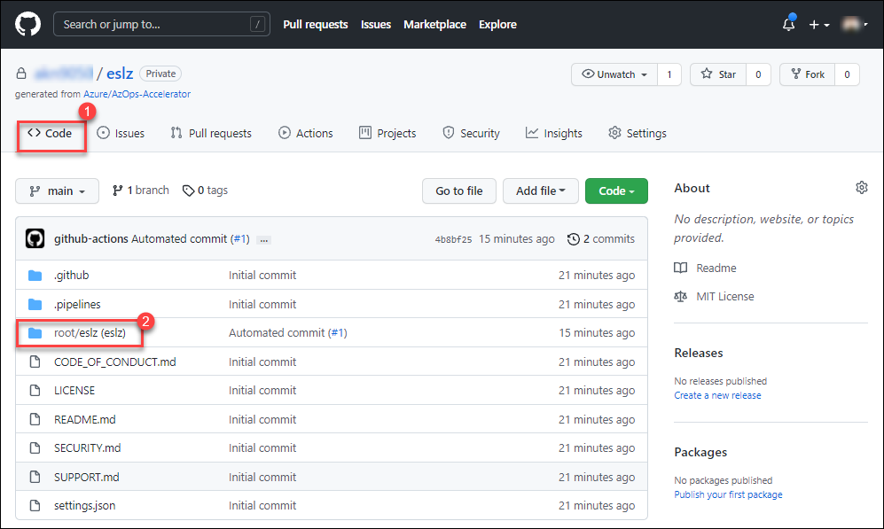
   
2. From here, navigate through the following path `root/eslz (eslz)/eslz-landingzones (eslz-landingzones)/eslz-online (eslz-online)/  (1)`, click on **Add file (2)** and then **Create new file**. 

   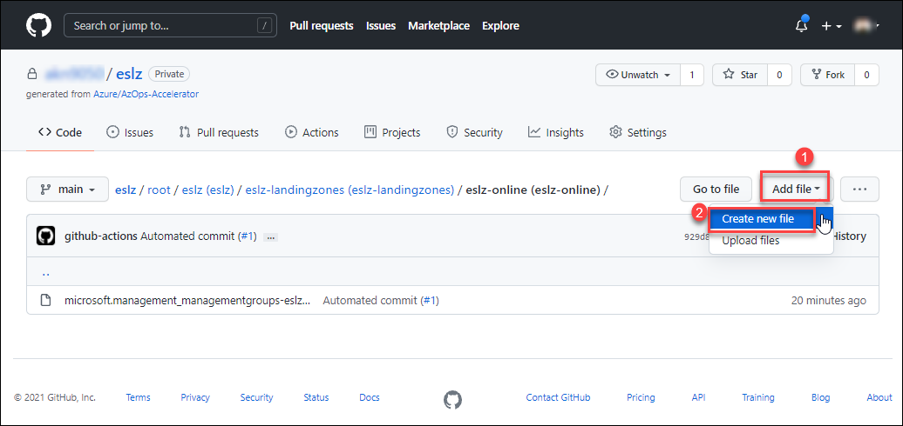
   
3. Name the file **"locationAssignment.json" (1)**, Copy and paste the following ARM template json in **Edit file (2)** pane. 
     * Select **Create a new branch for this commit and start a pull request (3) **
     * Branch Name: `location assignment` (4)
     * Now, click on **Propose new file (5)**

``` json
{
    "$schema": "https://schema.management.azure.com/schemas/2019-08-01/managementGroupDeploymentTemplate.json#",
    "contentVersion": "1.0.0.0",
    "parameters": {
        "policyAssignmentEnforcementMode": {
            "type": "string",
            "allowedValues": [
                "Default",
                "DoNotEnforce"
            ],
            "defaultValue": "DoNotEnforce",
            "metadata": {
                "description": "Input will determine if the policyAssignment should be enforced or not."
            }
        },
        "policyDefinitionId": {
            "type": "string",
            "defaultValue": "/providers/Microsoft.Authorization/policyDefinitions/e56962a6-4747-49cd-b67b-bf8b01975c4c",
            "metadata": {
                "description": "Provide the policyDefinition resourceId"
            }
        },
        "policyAssignmentName": {
            "type": "string",
            "defaultValue": "AllowedLocations"
        },
        "policyDescription": {
            "type": "string",
            "defaultValue": "Policy to ringfence Azure regions."
        },
        "listOfAllowedLocations": {
            "type": "array",
            "defaultValue": [
                "westeurope",
                "northeurope"
            ]
        }
    },
    "variables": {},
    "resources": [
        {
            "type": "Microsoft.Authorization/policyAssignments",
            "apiVersion": "2019-09-01",
            "name": "[parameters('policyAssignmentName')]",
            "identity": {
                "type": "SystemAssigned"
            },
            "location": "[deployment().location]",
            "properties": {
                "description": "[parameters('policyDescription')]",
                "displayName": "[parameters('policyDescription')]",
                "policyDefinitionId": "[parameters('policyDefinitionId')]",
                "enforcementMode": "[parameters('policyAssignmentEnforcementMode')]",
                "parameters": {
                    "listOfAllowedLocations": {
                        "value": "[parameters('listOfAllowedLocations')]"
                    }
                }
            }
        }
    ]
}
```

   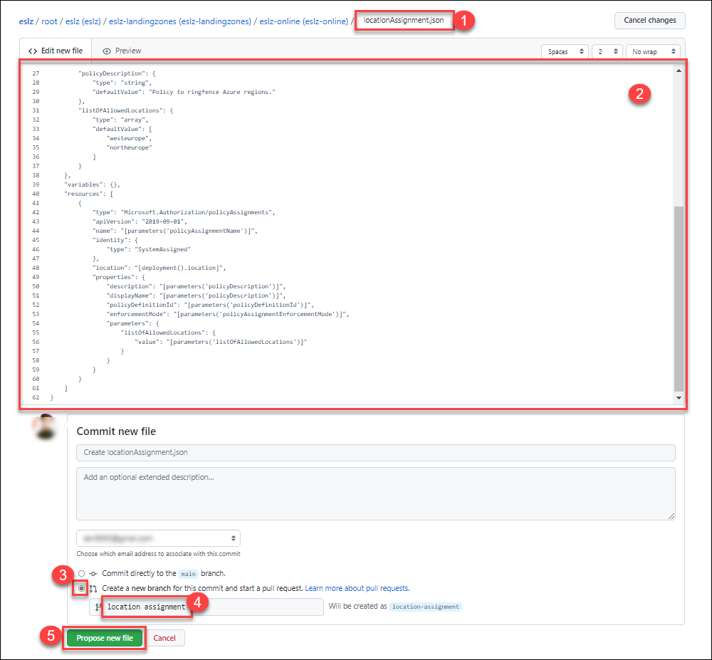
   
4. Now, click **Create pull request (1)**.  A new Pull Request is being created which will trigger the Push workflow. Go to **Actions (2)** to monitor the process.

   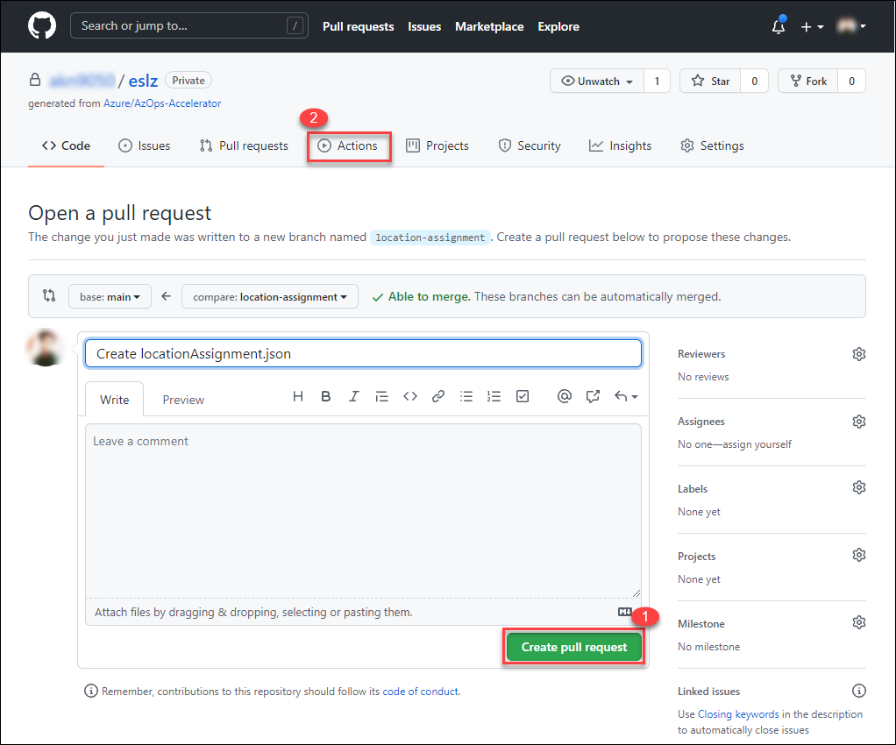
   
5. Under **Actions** tab, monitor the workflow runs, you will see **Create locationAssignment.json** run is in running or completed state.

   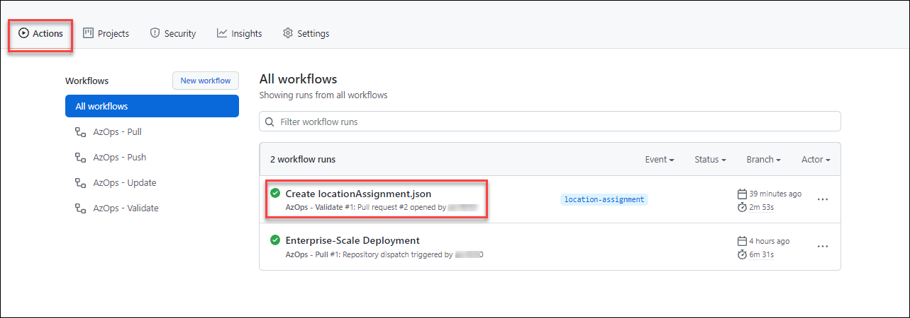

6. Once completed, switch back to **Pull requests** tab and then open the pull request which you have raised. The pull request will show **WhatIf results** as a comment.

   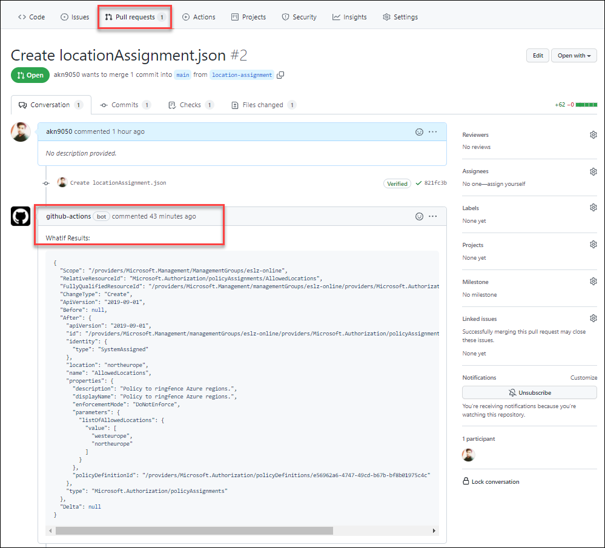

7. You should review the comment and then approve the pull request by completing the pull request by clicking **Squash and merge** and then **Confirm squash and merge**. You can also delete the branch once the merge has completed.

   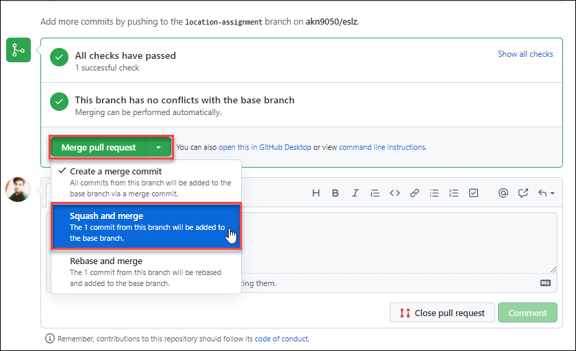

8. This will then kick-off the "AzOps - Push" workflow, that can be monitored under **Actions (1)** tab. You can monitor the progress more closely by clicking on **Create locationAssignment.json (#2) (2)** AzOps - Push #1: commit.

   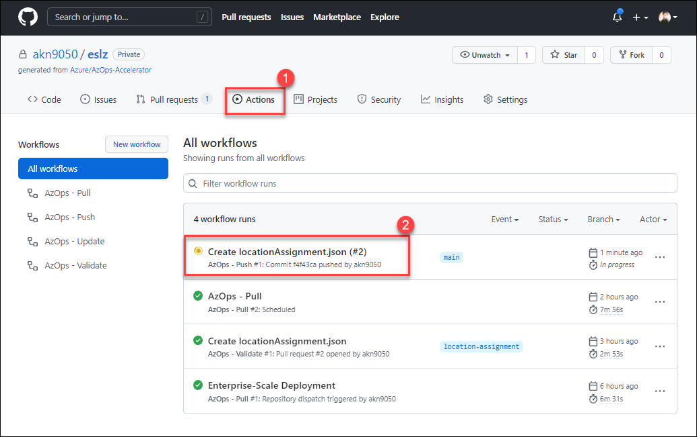
   
9. Once the push is completed, you will see **Status: Success** and push is checked.

   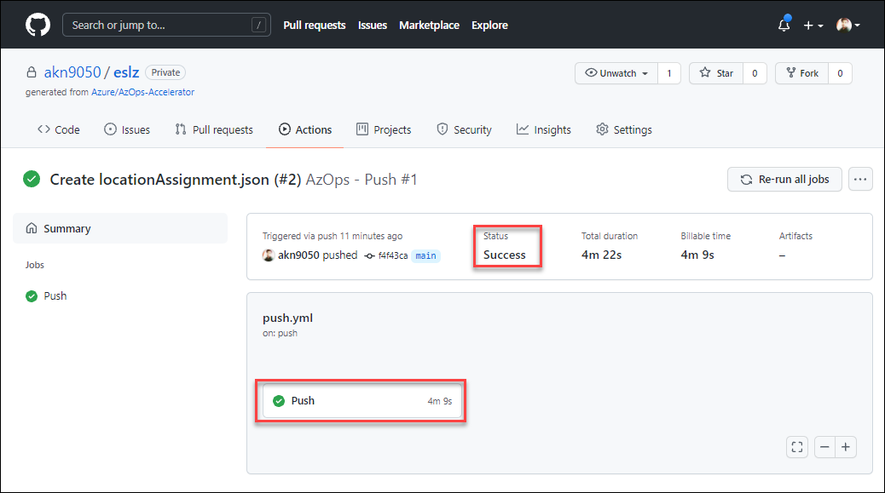

10. Now, go to teh Azure portal, where you have logged in already, in search box type `Management groups` (1) and then click on **Management groups** under services. 

    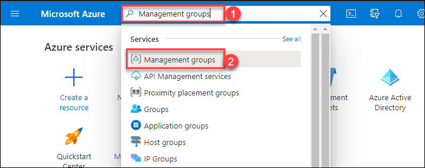
   
11. Now, on management groups tab, expand the herarchy **eslz (1)**, **eslz-landingzones (2)** and then click on **eslz-online (3)** management group.

    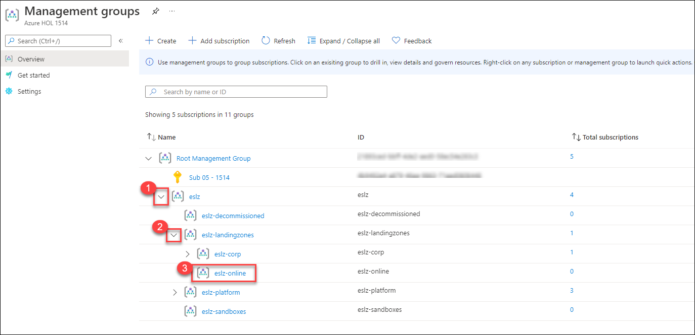
   
12. Under **eslz-online (1)** management group, click on **Deployments (2)** and then you will see **AzOps-locationAssignment (3)** in succeeded state.

    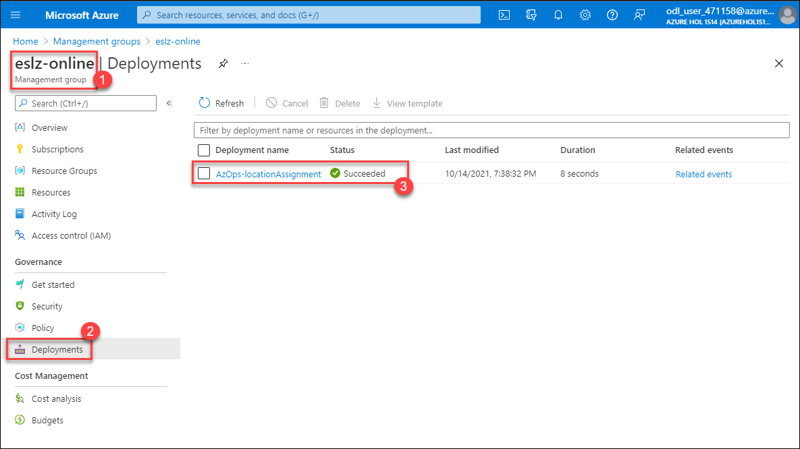
   
13. Navigate to **Policies (1) on the **eslz-online** management group and then navigate to **Assignments (2)** under **Authoring**. then, search for `Policy to ringfence Azure regions` (3) policy and verify that there’s a new assignment called **Policy to ring-fence Azure regions (4)**. Click on that.

    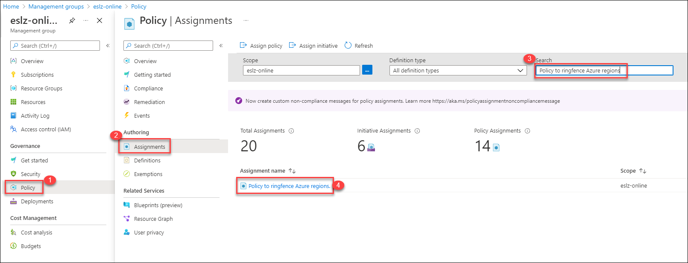
    
14. Select **Edit assignment**.

    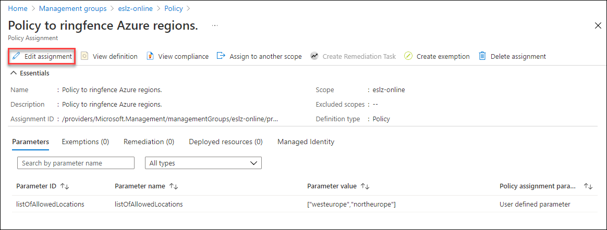
    
15. Verify that the Policy is not being enforced but will only scan for compliance and validate resources per the policy rule defined in the policy definition.

    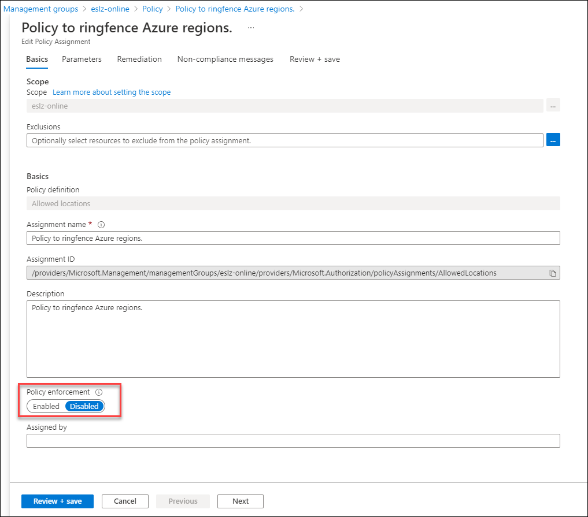

Once the policy compliance scan has completed, you will get a compliance result for the policy you assigned to validate the effect is working as intended, before going to the next step to update the enforcement mode. I.e., this policy will prevent resources being created outside of the allowed locations specified.

### Task 2: Update a Policy Assignment to enforce

In this task, we will modify the existing policy assignment to ensure the policy effect will be enforced.

1. Go back to the page where you have logged in your **GitHub account**. From there under **Code (1)**, navigate through the following path **root/eslz (eslz)/eslz-landingzones (eslz-landingzones)/eslz-online (eslz-online)/ (2)**, and click on **locationAssignment.json (3)**.

   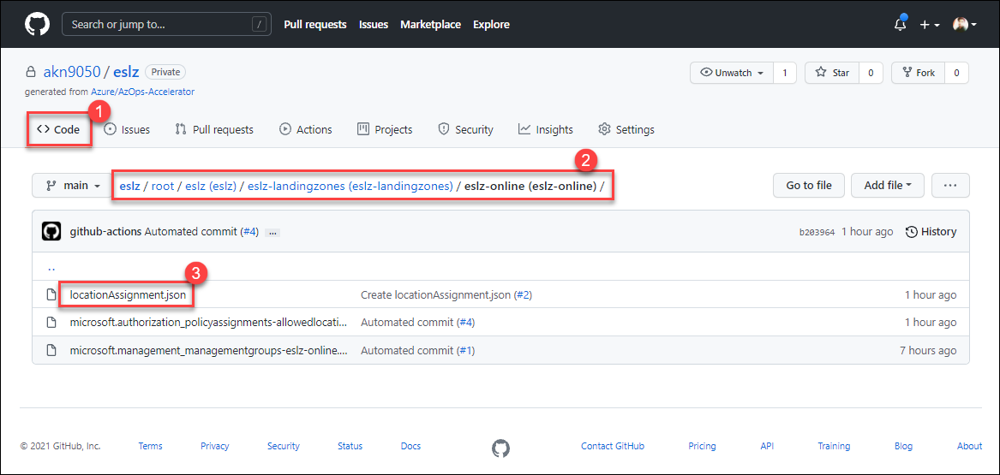
   
2. Now, click on the pencil icon 🖋  to edit the file.

   
   
3. Change the parameter “policyAssignmentEnforcementMode” default value to be `Default`.

   

4. On the ‘Commit changes’ dialogue box, select **Create a new branch for this commit and start a pull request**, and provide a branch name `Update Policy Assignment`. Click ‘Propose changes’.

   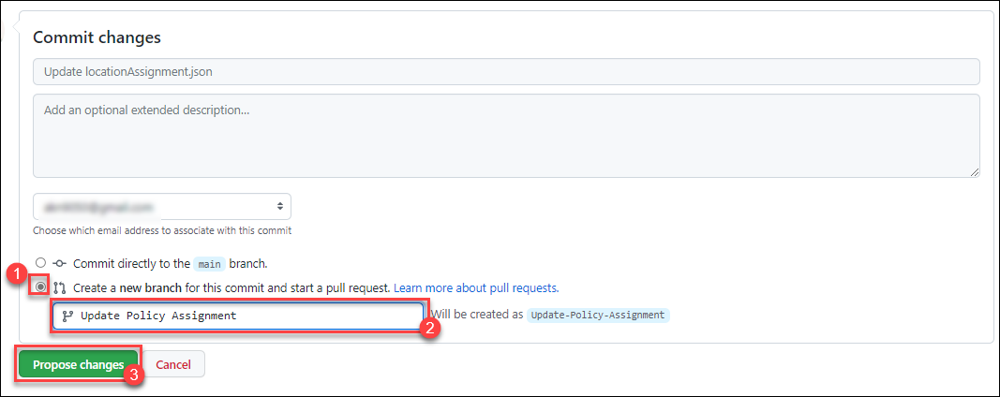
   
5. now, create the pull request.

   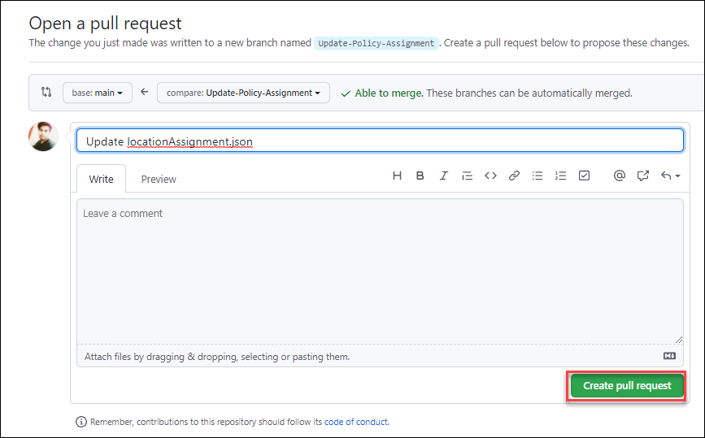
   
6. This will now start the same process as above by validating and showing a WhatIf output as a comment on the pull request. Once reviewed, approved and merged the AzOps push workflow will trigger and deploy the template with the updated property so that the policy effect will be enforced (in this case, deny resource creation outside of the ringfenced Azure regions). Follow same steps of task 1 from 7-15 and then, revisit the policy in Azure portal and see that the policy enforcement is set to ‘Enabled’.

   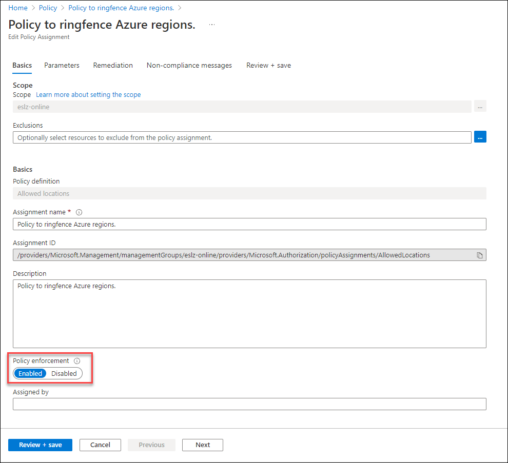

### Task 3: Create new Role Assignment on a landing zone

To grant a user, a group, or a service principal access to a landing zone (subscription), you can use the following ARM template where you provide the principalId (object id of the user, group, or service principal) as input to the parameter, and place the template into the subscription folder into your landing zone management group(s).

Replace Provide-Principal-Id with ID of the principal.

```
{
    "$schema": "https://schema.management.azure.com/schemas/2018-05-01/subscriptionDeploymentTemplate.json#",
    "contentVersion": "1.0.0.0",
    "parameters": {
        "principalId": {
            "type": "string",
            "defaultValue": "<Provide-Principal-Id>",
            "metadata": {
                "description": "Provide the objectId of the principal (user, group, SPN, managed identity etc.) that will be granted RBAC at scope."
            }
        },
        "roleDefinitionId": {
            "type": "string",
            "defaultValue": "b24988ac-6180-42a0-ab88-20f7382dd24c",
            "metadata": {
                "description": "Provide the id of the built-in roleDefinition. Default is 'Contributor'."
            }
        }
    },
    "resources": [
        {
            "type": "Microsoft.Authorization/roleAssignments",
            "apiVersion": "2017-09-01",
            "name": "[guid(parameters('principalId'))]",
            "properties": {
                "principalId": "[parameters('principalId')]",
                "roleDefinitionId": "[concat('/providers/Microsoft.Authorization/roleDefinitions/', parameters('roleDefinitionId'))]"
            }
        }
    ]
} 
```


