# Lab 03: CCO Azure Governance Dashboard

The CCO Azure Governance Dashboard is aligned with the Microsoft Cloud Adoption Framework governance principles and will allow to get quick insights around Management Groups, Subscriptions, Blueprints, Polices, Naming Standards, Tagging and Regulatory Standards compliance. The information captured on this Power BI Dashboard can help Cloud Teams, Operations Teams or business decision makers to have a snapshot of the current Azure configuration in just few minutes.

## Exercise 1: Installing the custom connector

1. In your JumpVM, launch **Power BI Desktop** from desktop shortcut.

   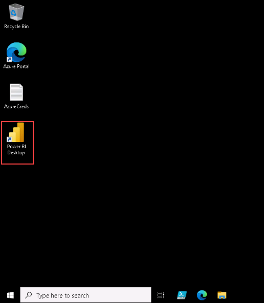

> **Note:** If you are prompted with Power BI 'Getting started* page, then click on the **X** button on the top right corner.
>
>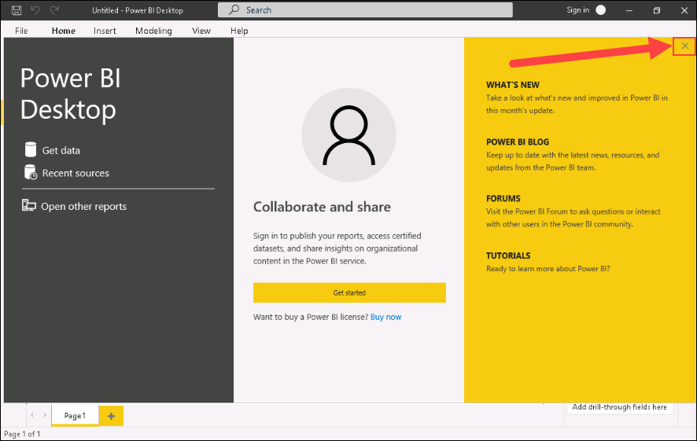

2. On top left corner, click on **File**.

   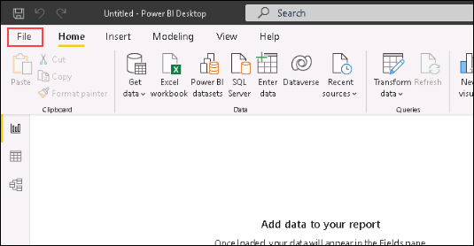


3. Click on **Options and Settings** *(1)* and then select **Options** *(2)*.

   

4. On the options page, under "GLOBAL' click on **Security** *(1)* and select **(Not Recommended) Allow any extension to load without validation or warning** *(1)* under 'Data Extensions' then click on **Ok** *(3)*.

   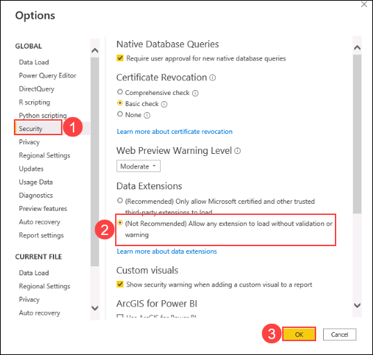

5. On the prompt saying *'Change Requires Restart'* click on **Ok**.

   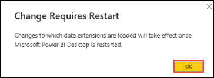


## Exercise 2: Setting up the CCO Azure Governance Dashboard Governance

### Task 1: Modify Privacy settings

1. Now in PowerBI, click on **File** on the top left corner.

   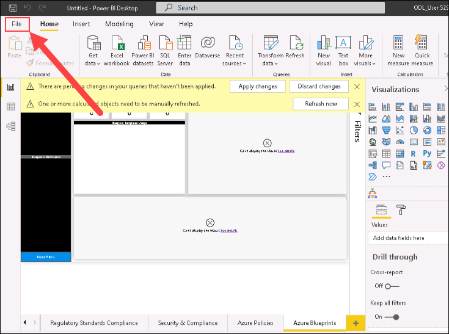

2. Click on **Options and settings** and then click on **Options**.

   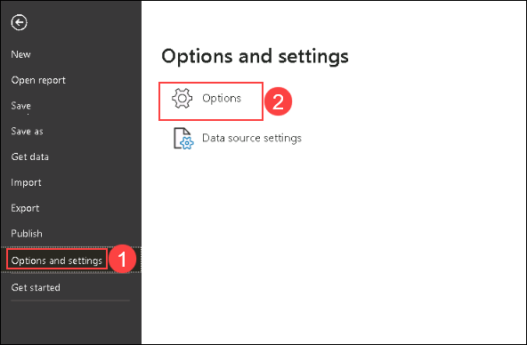

3. On the options page, click on **Privacy** *(1)* under 'Global' and then select **Always ignore Privacy Level settings** *(2)* then, click on **OK** *(3)*.

   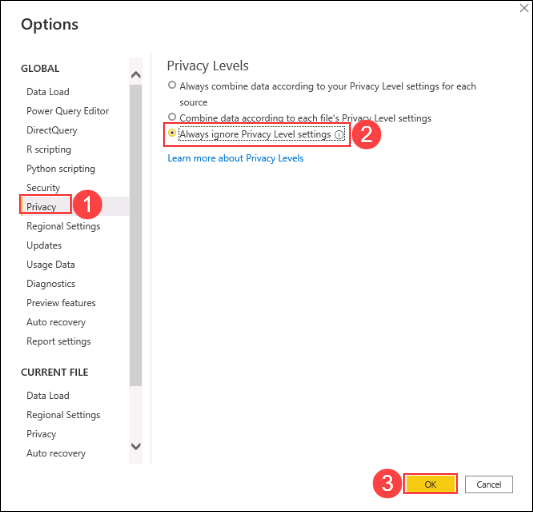

4. Close the PowerBI desktop before proceeding with the next task.

### Task 2: Environment selection

1. Go to **Start** *(1)* and open **File Explorer** *(2)*.

   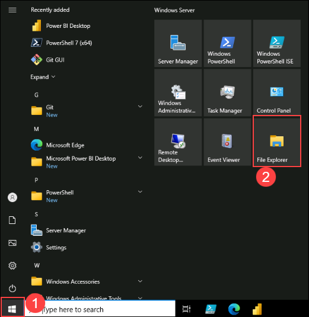

2. Now in file explorer go to ```C:\LabFiles``` *(1)* directory and double click on **CCO Power BI governance dashboard** *(2)* file.

   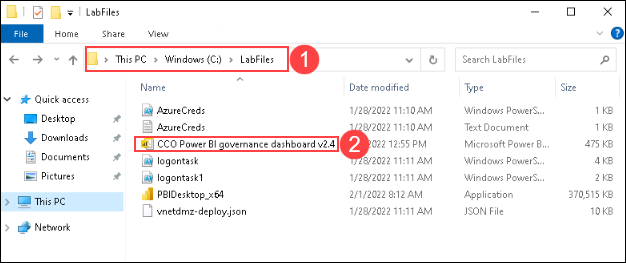

3. Now PowerBI desktop will launch, and it will ask you to **Enter your email address**, enter **<inject key="AzureAdUserEmail" />** *(1)* and click on **Continue** *(2)*.

   

4. If prompted to **pick an account**, then click on your account.

   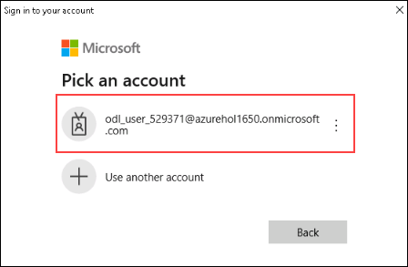

5. Enter your password, i.e. **<inject key="AzureAdUserPassword" />** *(1)*, and click on **Sign in** *(2)*.

   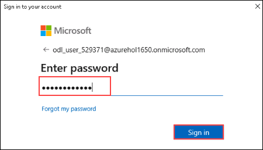

6. In 2 to 3 seconds there will be another prompt to *'Select "Global" for Azure Commercial or "US-Government" for Azure US Government'*, here select **global** *(1)* from drop down and click on **Load**.

   

7. Now there will be another *'Access web content'* prompt. Here click on **Organizational accounts** *(1)* and then click on **Sign in** *(2)*.

   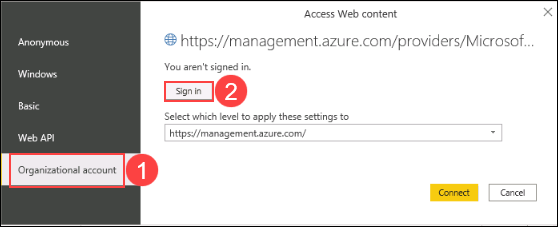

8. On pick an account page, click on **<inject key="AzureAdUserEmail" />** account.

   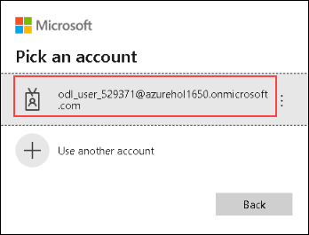

8. Enter the password If asked to enter the password then enter the following password **<inject key="AzureAdUserPassword" />** *(1)* and click on **Sign in** *(2)*.

   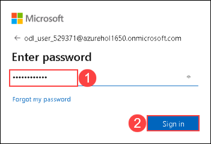

9. Once signed in, click on **Connect**.

   

10. Now on **Connect CCO Dashboard to your Azure subscription** prompt, click on **Sign in**.

   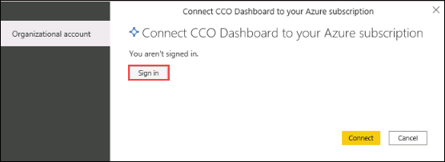

11. on a new popup to authorize login, enter the following  credentials, and click on **Sign in**.

    - Username: **<inject key="AzureAdUserEmail" />**
    - Password: **<inject key="AzureAdUserPassword" />** 

   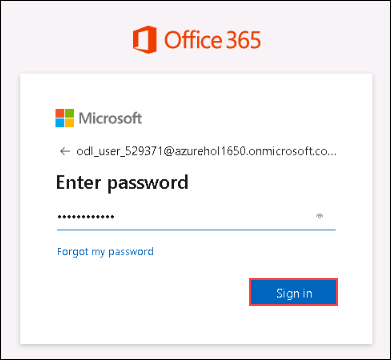

12. Once the above steps are performed, click on **Connect**.

   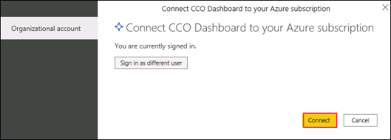


## Exercise 3: Report Pages

### Task 1: Management Groups and Subscriptions Hierarchy Overview page

In this page, you will be able to easily identify the hierarchy within your environment with the view of the Management Groups and Subscriptions. It's important to mention that this page just gives you a quick view.

1. In PowerBI desktop, go to **Hierarchy Overview** sheet and explore the 'Management Groups and Subscriptions Hierarchy'.

   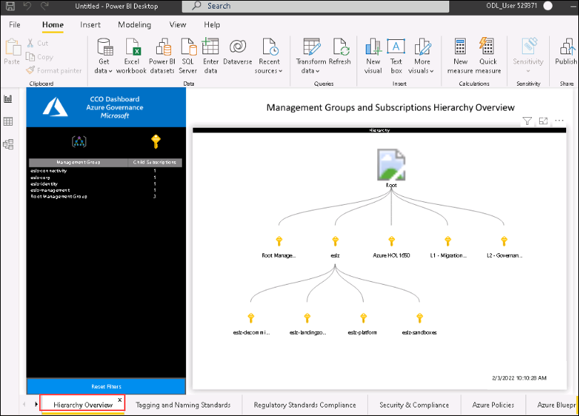

### Task 2: Tags and naming standards page

In this page you will be able to sort and filter all your Resources and Resource groups based on Tags. It will help you identify any missing Tag and if your naming standards and Tags classifications adheres to your organization guidelines or policies.

1. In PowerBI desktop, go to **Tags and naming standards** sheet *(1)*.

2. Here you can filter data through selecting the **Management Group with subscriptions** *(1)* and **subscriptions** *(2)* and explore the data produced.

   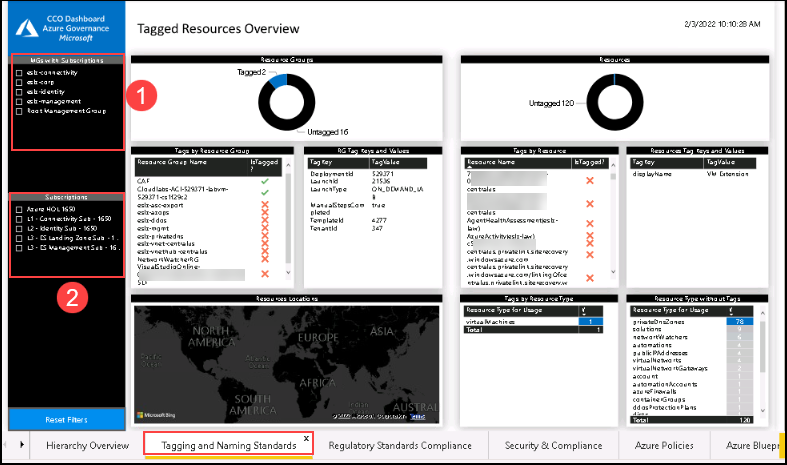

### Task 3: Azure Regulatory Standards Forecast

In this page you can compare your current Azure resources compliance against selected Regulatory Standards, to understand how far from a given Regulatory Standard your current Azure footprint is today. For more information check the published Regulatory Standards.

1. In PowerBI desktop, go to **Regulatory Standards Compliance** sheet *(1)*.

   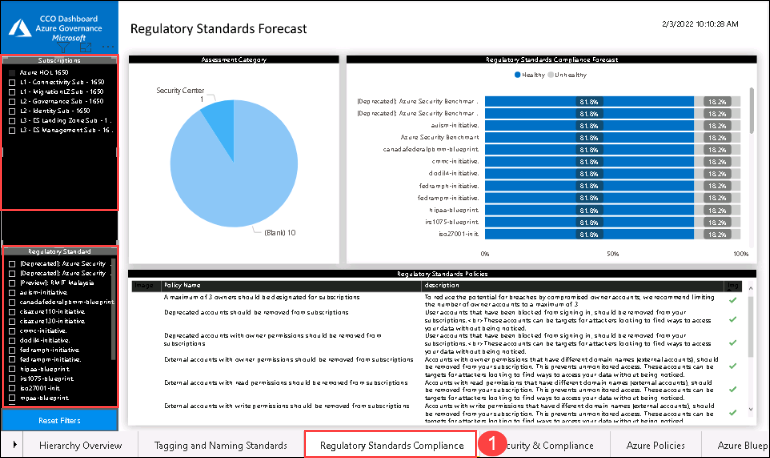

2. Here filter the data through **Subscription**, **Regulatory Compliance** and **Assessment Category** then explore the data produced.

### Task 4: Azure Resources Security & Compliance page

In this page you can check the compliance status of your Azure resources based on the Azure Security Center Secure Score Controls and the corresponding Policy Set or Regulatory Standard.

1. In PowerBI desktop, go to **Security & Compliance** *(1)* sheet and then explore the data by filtering it based on **Subscription**, **Policy Set**, **Regulatory Standard Name**, **Secure Controls** and **Policy Category** *(2)*.

   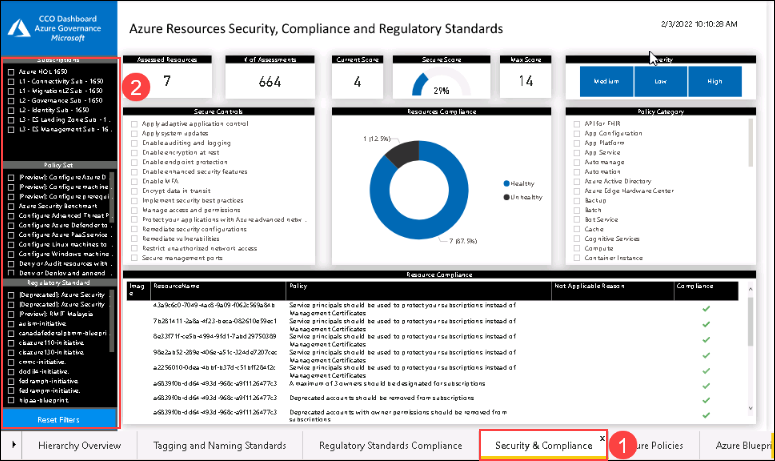


### Task 5: Azure Policies page

In this page of the report, you will be able to identify the total amount of policies that are you applying in your environment. It will also give a high-level overview of which policies has less compliance level and which resources require more attention.

1. In PowerBI desktop, go to **Azure Policies** *(1)* sheet and then explore the data by filtering it based on **Management Group with subscriptions**, **Subscription** and **Policy scope** *(2)*.

   


### Task 6: Azure Blueprints page

In this page of the report, you will be able to identify the total amount of blueprints that are you applying in your environment. It will also show which are the artifacts within the blueprints.

1. In PowerBI desktop, go to **Azure Policies** *(1)* sheet and then explore the data by filtering it based on **Management Group with subscriptions**, **Subscription** and **Policy scope** *(2)*.

   

### Task 7: Azure Blueprints page

In this page of the report, you will be able to identify the total amount of blueprints that are you applying in your environment. It will also show which are the artifacts within the blueprints.

1. In PowerBI desktop, go to **Azure Blueprints** *(1)* sheet and then explore the data by filtering it based on **Blueprint Definition** and **Subscription with assigned blueprints** *(2)*.

   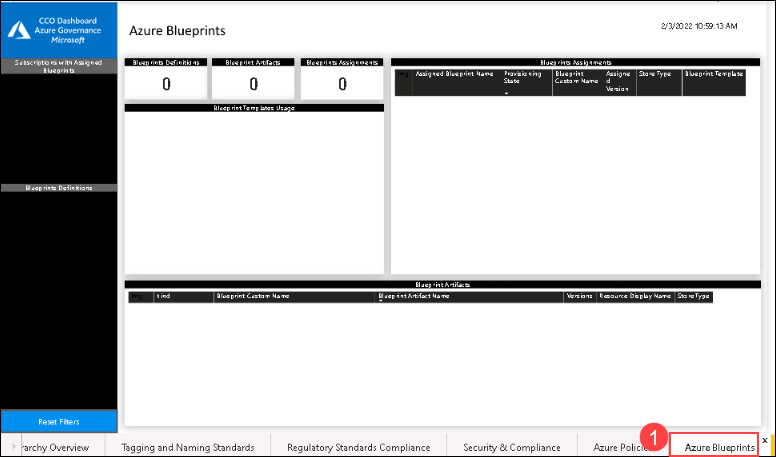